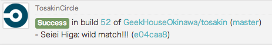

Tosakin
====


[](https://coveralls.io/r/GeekHouseOkinawa/tosakin)
[](https://codeclimate.com/github/GeekHouseOkinawa/tosakin)
[](https://gemnasium.com/GeekHouseOkinawa/tosakin)

Tosakin is an idobata generic webhook adapter for any webhooks.

## Deploy to Heroku
```
$ git clone https://github.com/GeekHouseOkinawa/tosakin.git
$ cd tosakin
$ heroku create
$ git push heroku master
$ heroku run rake db:migrate
$ heroku config:add IDOBATA_HOOK_URL=YOUR_IDOBATA_HOOK_URL
```

## Supports
- [CircleCI](https://circleci.com/)
- TODO: and more.

### CircleCI


In your `circle.yml`

```
notify:
  webhooks:
    - url: http://<YOUR_HEROKU_APP_NAME_HERE>.herokuapp.com/circle
```

or

```
notify:
  webhooks:
    - url: http://<YOUR_HEROKU_APP_NAME_HERE>.herokuapp.com/circle?idobata_hook_url=https%3A%2F%2Fidobata.io%2Fhook%2F<YOUR_IDOBATA_HOOK_API_TOKEN_HERE>
```
