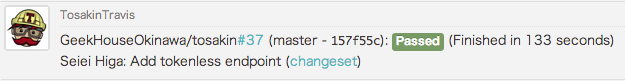

Tosakin
====


[](https://travis-ci.org/GeekHouseOkinawa/tosakin)
[](https://coveralls.io/r/GeekHouseOkinawa/tosakin)
[](https://codeclimate.com/github/GeekHouseOkinawa/tosakin)
[](https://gemnasium.com/GeekHouseOkinawa/tosakin)

Tosakin is an idobata generic webhook adapter for any webhooks.

** PLEASE DON'T USE THIS. **

This repository is not maintained. 

use [idobata/idobata-hooks](https://github.com/idobata/idobata-hooks) instead.


## Deploy to Heroku
```
$ git clone https://github.com/GeekHouseOkinawa/tosakin.git
$ cd tosakin
$ heroku create
$ git push heroku master
$ heroku run rake db:migrate
$ heroku config:add IDOBATA_HOOK_URL=YOUR_IDOBATA_HOOK_URL
```

## Supports
- TODO: BitBucket
- TODO: Generic
- TODO: GitHub
- TODO: Heroku
- TODO: Jenkins
- TODO: New Relic
- TODO: Papertrail
- TODO: PivotalTracker
- [TravisCI](https://travis-ci.org/)
- [CircleCI](https://circleci.com/)

### TravisCI


In your `travis.yml`

```
notifications:
  webhooks:
    - http://<YOUR_HEROKU_APP_NAME_HERE>.herokuapp.com/hook/
```

or

```
notifications:
  webhooks:
    - http://<YOUR_HEROKU_APP_NAME_HERE>.herokuapp.com/hook/<YOUR_IDOBATA_HOOK_API_TOKEN_HERE>
```

#### Customize template
In your `config/initializers/tosakin_travis_ci_custom_template.rb`
``` ruby
TosakinTravisCi::TravisCiBuildFormatter.template = <<'TEMPLATE'
<%= label %> in build <a href="<%= travis_ci_build_url %>">#<%= number %></a>
TEMPLATE
```

### CircleCI


In your `circle.yml`

```
notify:
  webhooks:
    - url: http://<YOUR_HEROKU_APP_NAME_HERE>.herokuapp.com/hook
```

or

```
notify:
  webhooks:
    - url: http://<YOUR_HEROKU_APP_NAME_HERE>.herokuapp.com/hook/<YOUR_IDOBATA_HOOK_API_TOKEN_HERE>
```

#### Customize template
In your `config/initializers/tosakin_circle_ci_custom_template.rb`
``` ruby
TosakinCircleCi::CircleCiBuildFormatter.template = <<'TEMPLATE'
<%= label %> in build <a href="<%= build_url %>"><%= build_num %></a>
TEMPLATE
```
